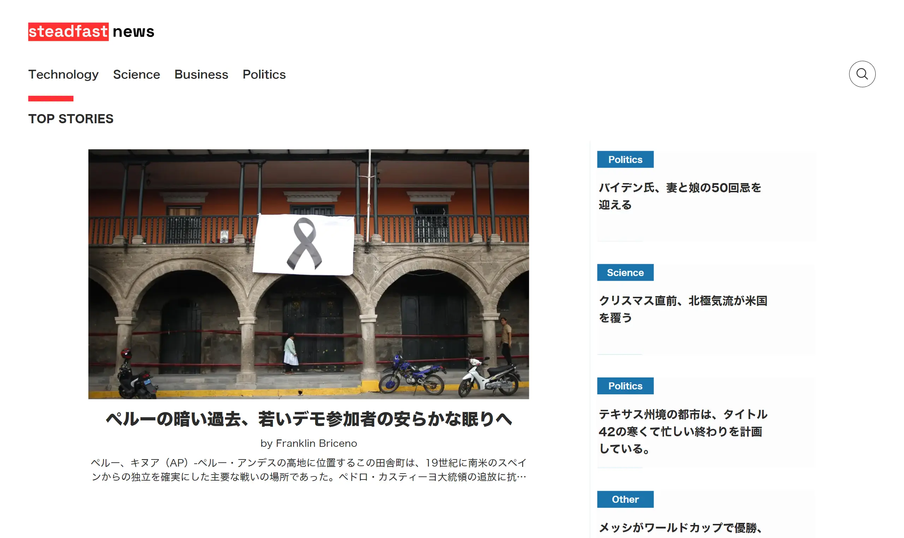

- [About Project](#about-project-img-srchttpsemojipedia-uss3dualstackus-west-1amazonawscomthumbs240twitter322shibuya_e50apng-altsauropod-styleheight1emwidth1emmargin0-005em-0-01emvertical-align-01em)
- [Quick Start](#quick-start-img-srchttpstwemojimaxcdncomv131072x721f680png-altsauropod-styleheight1emwidth1emmargin0-005em-0-01emvertical-align-01em)
    - [Environment](#environment)
    - [Set environment variables](#set-environment-variables)
    - [Boot development](#boot-development)
- [CMS](#cms)

## About Project 

Steadfast News はメディア・バイアスに強いニュースソースを厳選したニュースサイトです。  
現在は`Reuters`, `AP News`, `Forbes`をニュースソースとしています。



## Quick Start 

### Environment


### Set environment variables

```shell
cp sample.env .env
```

### Boot development

```shell
  npm i
  npm run dev
```

# CMS


## License

[MIT](./LICENSE)
